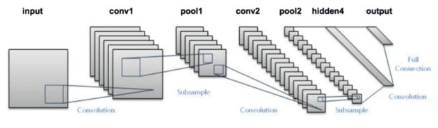
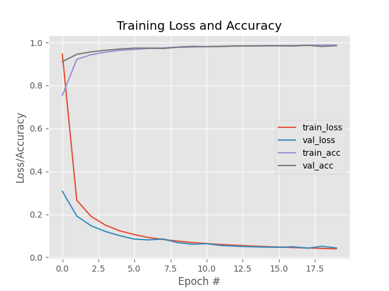

# LeNet-in-Keras-with-MNIST
In this project we recreate the LeNet architecture in Keras / Tensorflow and run it against the MNIST dataset for evaluation.

## Description
LeNet was first introduced in 1998 by Yann LeCun with the intention of being used mainly for
optical character recognition, which is why we are going to run the MNIST dataset against it.

LeNet is pretty straightforward and has the architecture outlined below:
```buildoutcfg
    INPUT => CONV => TANH => POOL => CONV => TANH => POOL =>
        FC => TANH => FC
```

A visual representation can be seen below (from [Pyimagesearch](https://pyimagesearch.com/2021/05/22/lenet-recognizing-handwritten-digits/?_ga=2.207428624.2094560864.1648096932-895121412.1648096932)):  



Much more about LeNet and it's architecture can be read here: [IEEEXPLORE](https://ieeexplore.ieee.org/author/37282875900))

### Model Architecture in Python (using Keras / Tensorflow)
The code for this model can be found in 'scripts/fundamentals/neuralnet/architectures.py' and is essentially created in Keras
with these lines of code:

```buildoutcfg		
        # (1) Add first CONV => RELU => POOL layers
		# "same" means the output layer H and W will be same as input
		model.add(Conv2D(20, (5, 5), padding="same",
			input_shape=input_shape))
		# ReLu act
		model.add(Activation("relu"))
		# Pooling to decrease size (in half)
		model.add(MaxPooling2D(pool_size=(2, 2), strides=(2, 2)))

		# second set of CONV => RELU => POOL layers
		# "same" means the output layer H and W will be same as input
		model.add(Conv2D(50, (5, 5), padding="same"))
		# ReLu act
		model.add(Activation("relu"))
		# Pooling to decrease size (in half)
		model.add(MaxPooling2D(pool_size=(2, 2), strides=(2, 2)))

		# Add fully connected layers
		# Need to flatted from 2D to 1D vectore
		model.add(Flatten())
		# We'll go down to 500 nodes
		model.add(Dense(500))
		#  Add ReLu act
		model.add(Activation("relu"))

		# Narrow down to number of classes
		model.add(Dense(classes))
		# And finally the softmax for classifying
		model.add(Activation("softmax"))
```

## Results

### MNIST Dataset
Code can be found in 'scripts/MNIST_lenet_cnn.py.  

For this dataset we use a LeNet architecture with 20 epochs and a learning
rate (SGD) of 0.01.

The results summary can be seen below:
```buildoutcfg
              precision    recall  f1-score   support

           0       0.99      0.99      0.99       980
           1       0.99      0.99      0.99      1135
           2       0.99      0.98      0.99      1032
           3       0.97      1.00      0.98      1010
           4       0.99      0.99      0.99       982
           5       0.99      0.98      0.99       892
           6       0.99      0.99      0.99       958
           7       0.98      0.99      0.98      1028
           8       0.98      0.98      0.98       974
           9       0.99      0.97      0.98      1009

    accuracy                           0.99     10000
   macro avg       0.99      0.99      0.99     10000
weighted avg       0.99      0.99      0.99     10000

```

The training loss and accuracy plot for both the training and validation 
datasets can be seen below:



We see by examining the plot of loss and accuracy that we
struggle with overfitting after the initial few epochs. Although loss initially decreases, after about epoch 5 the accuracy remains 
the same all while our training loss consistently decreases. This is a good example of model overfitting.  

So what do we do if our basic CNNs not performing for our dataset? We'll have to add more layers (obviously)
and increase our model generalization by adding regularization (Possibly Batch normalization or Dropout layers). 

## Getting Started

### Dependencies

See requirements.txt

### Installing

#### Clone the project:
```
git clone git@github.com:reedajohns/LeNet-in-Keras-with-MNIST.git
```

### Executing program

Open terminal and run either command:
```
python MNIST_lenet_cnn.py --output ../media/keras_lenet_cnn_mnist.png --model ../models/lenet_weights.hdf5
```

## Authors

Contributors names and contact info

Reed Johnson (https://www.linkedin.com/in/reed-a-johnson/)

## Version History

* 0.1
    * Initial Release

## License

This project is licensed under the GNU GENERAL PUBLIC License - see the LICENSE.md file for details

## Acknowledgments

Inspiration, code snippets, etc.
* [Pyimagesearch](https://pyimagesearch.com/2021/05/22/lenet-recognizing-handwritten-digits/?_ga=2.207428624.2094560864.1648096932-895121412.1648096932)